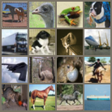
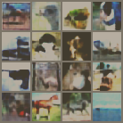
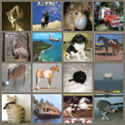
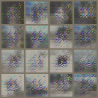

# Autoencoder for backbone classifier

## The dataset
We first playaround on CIFAR10 dataset. 
## The backbone
We used a simple convolutional neural network with 2 bottleneck structure(credits to CS838 homework) to pretrain on CIFAR-10 for 100 epoch using Adam optmizer, the final accuracy on test dataset is 73.2%.
## The autoencoder
We used a simple convolution-deconvolution autoencoder, details in `encoder/simpleconv.py`. We used Adam optimizer when training the autoencoder.
## Training without backbone classifer
We train the encoder network without adding the cross entropy loss of the backbone classifier into the loss function. This is a normal autoencoder structure. We trained the encoder for 30 epochs due to economy limitation. The sample result on test datasets shown as following.

 

Accuracy on the decoded image is: 0.496

## Training with backbone classifier

We then train the encoder simply adding the cross entropy loss of the backbone classifier into the loss function. For proof of concept reason, we did not multiply any coefficient yet. The sample result are shown below

 

Accuracy on the decoded image is: 0.638